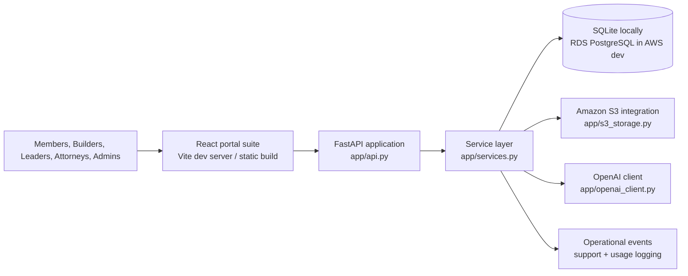
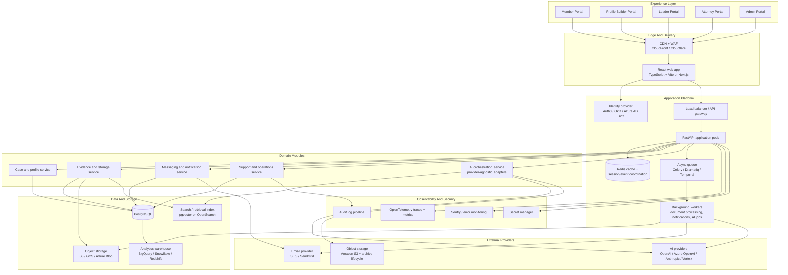

# Solution Architecture

This document describes the current Ascend product-suite architecture and the recommended scaled-world target architecture.

The goal is not to force an immediate rewrite. The goal is to make the current system understandable, define clean growth boundaries, and keep the platform operable even when storage or AI providers are unavailable.

## Architecture Principles

- Keep one shared case and evidence model across all portals.
- Preserve graceful degradation when AI or storage integrations are unavailable.
- Prefer modular boundaries before microservice sprawl.
- Keep provider integrations replaceable.
- Make every workflow observable, auditable, and resumable.

## Current Runtime Architecture

The current repository runs as a modular product suite with a React frontend, FastAPI backend, SQLite persistence for local development, RDS PostgreSQL in AWS dev, S3-backed file storage, and OpenAI-backed AI flows with deterministic fallback behavior.

## Scaled-World Target Architecture

The recommended scaled design keeps Ascend as a modular platform, but replaces local-only dependencies with managed services and adds clearer isolation for identity, async processing, storage, and AI orchestration.

## Recommended Scaled Tech Stack

| Layer | Current Repo | Scaled Recommendation |
| --- | --- | --- |
| Frontend | React + Vite + shared CSS in `frontend-react/` | React + TypeScript + Vite or Next.js, shared component library, design tokens, query/state layer |
| Edge | Localhost development only | CDN, WAF, TLS termination, static asset delivery |
| Identity | Seeded local credentials | Managed identity provider with RBAC, MFA, invite flows, audit-friendly session controls |
| API | FastAPI + Uvicorn | FastAPI behind load balancer/API gateway, horizontal pod scaling |
| Domain logic | `app/services.py` monolith-style service layer | Modular domain packages by cases, evidence, messaging, support, AI |
| Database | SQLite locally, RDS PostgreSQL in AWS dev | PostgreSQL with migrations and backup/restore policy |
| Cache/session coordination | None | Redis for caching, throttling, ephemeral coordination, queue support |
| Async workloads | Inline request processing | Queue + workers for AI jobs, document indexing, email, ticket receipts, batch intake |
| File storage | Amazon S3 + local metadata mirror fallback | Object storage abstraction with signed URLs, lifecycle archive rules, retention controls |
| Search/retrieval | In-request document ranking | pgvector or OpenSearch for evidence retrieval and AI grounding |
| AI integration | `app/openai_client.py` only | Provider-agnostic orchestration layer with OpenAI, Azure OpenAI, Anthropic, or Vertex adapters |
| Notifications | In-app only | Email/SMS provider integration with retry and delivery logs |
| Observability | Local logs + admin debug surface | OpenTelemetry, centralized logs, Sentry, metrics dashboards, alerting |
| Secrets | Environment variables | Secret manager with rotation, environment separation, least-privilege access |
| Delivery | Local commands and manual push | GitHub Actions, staged environments, migration gates, release promotion |

## Why A Modular Monolith First

Ascend does not need to split immediately into many independently deployed services. The codebase will scale more safely if it first becomes a well-structured modular monolith with:

- separate domain modules
- repository interfaces around persistence
- provider interfaces around AI and storage
- queue-backed long-running work
- formal migrations and environment-specific configuration

That keeps local development simple while still preparing the platform for later extraction if any domain becomes independently scalable.

## Recommended Domain Boundaries

### Identity And Access

- portal-aware authentication
- role-to-capability mapping
- invite, onboarding, password reset, MFA, audit trails

### Case And Profile Domain

- member records
- case readiness scoring
- profile completeness
- assignments and ownership

### Evidence Domain

- evidence metadata
- criterion grouping
- file storage adapters
- previews, retention, deletion, and citations

### Messaging And Notifications

- in-app threads
- mailbox receipts
- invite and support notifications
- delivery logs and retry behavior

### Support And Operations

- support-ticket intake
- admin ticket triage
- operational event stream
- product health surfaces

### AI Orchestration

- provider adapters
- prompt registry and versioning
- retrieval and citation assembly
- confidence thresholds and fallback behavior

## AI-Agnostic Design Guidance

To keep the suite understandable and portable, AI should remain an implementation detail behind a stable application boundary.

Recommended contract:

- `AIProvider`: summarize, classify, answer, draft
- `RetrievalProvider`: search evidence, return ranked excerpts
- `CitationFormatter`: render storage-backed references consistently
- `FallbackPolicy`: deterministic behavior when AI is unavailable

That lets the product change models or providers without rewriting portal logic.

## Migration Path From Current State

1. Split `frontend-react/src/App.jsx` into portal modules and shared UI primitives.
2. Split `app/services.py` into domain services with narrow interfaces.
3. Move from SQLite to PostgreSQL with formal migrations.
4. Introduce Redis plus a worker queue for AI and file-processing work.
5. Replace direct storage assumptions with a storage-provider interface.
6. Replace direct OpenAI usage with provider adapters and prompt registry modules.
7. Add managed identity, environment-aware secrets, and CI/CD promotion gates.

## Related Documents

- `README.md`
- `docs/feature-catalog.md`
- `docs/missing-features.md`
- `docs/verification-notes.md`
