# Ascend Product Suite Solution Architecture

Generated: 2026-05-10

This document defines the connected solution architecture for the Ascend Product Suite. It explains the technology stack, how every major component talks to the others, and how member, profile builder, attorney, leader, and admin workflows move through the platform.

The goal is to keep the current product understandable while creating a clean path toward a production-grade EB1A case operating system.

## Architecture Goals

- Support one shared EB1A case and evidence model across all portals.
- Let members provide structured evidence once and make it reviewable by profile builders, attorneys, leaders, and admins.
- Preserve reliable behavior when AI, storage, or third-party services are temporarily unavailable.
- Keep all sensitive workflows auditable through timestamps, actor identity, backend events, and storage history.
- Use managed AWS services for secure, low-maintenance hosting.
- Keep the codebase modular enough to scale without prematurely splitting into many microservices.

## Current Production-Oriented Stack

| Layer | Technology | Purpose |
| --- | --- | --- |
| Frontend app | React + Vite | Multi-portal single-page application for member, profile builder, attorney, leader, and admin users. |
| Frontend hosting | Amazon S3 + Amazon CloudFront | Static asset hosting, HTTPS delivery, SPA fallback routing, and path-based API routing. |
| API edge | CloudFront path behaviors + Application Load Balancer | Routes `/api/*`, `/health`, `/ready`, `/docs`, and `/openapi.json` to the backend. |
| Backend runtime | FastAPI + Uvicorn on ECS Fargate | Main application API and service layer. |
| Container registry | Amazon ECR | Stores backend container images used by ECS. |
| Primary database | SQLite locally, RDS PostgreSQL in AWS target/runtime | Stores members, cases, evidence metadata, portal data, messages, sessions, audits, projects, recommendations, and admin snapshots. |
| Evidence storage | Amazon S3 active bucket + archive bucket | Stores uploaded evidence, generated exports, and archived soft-deleted files. |
| Local storage fallback | Local upload and mirror directories | Keeps local development functional without cloud storage. |
| Legacy/optional storage | Google Drive adapter | Non-current provider path retained for compatibility when explicitly configured. |
| AI provider | OpenAI through `app/openai_client.py` | Evidence classification, summaries, petition drafting, support triage, and recommendation/endeavor letter assistance. |
| Operations mirror | DynamoDB issue log table | Mirrors issue portal records for operational durability and admin monitoring. |
| Secrets | AWS Secrets Manager | Stores database URL and OpenAI API key for backend tasks. |
| Observability | CloudFront logs, ALB logs, S3 log bucket, Athena, admin health portal | Supports debugging, issue review, cost review, and operational visibility. |
| Infrastructure as code | Terraform in AWS deployment repo | Creates and updates CloudFront, S3, ECS, ALB, ECR, RDS, IAM, Secrets Manager, Athena, and networking. |

## Connected AWS Runtime Architecture

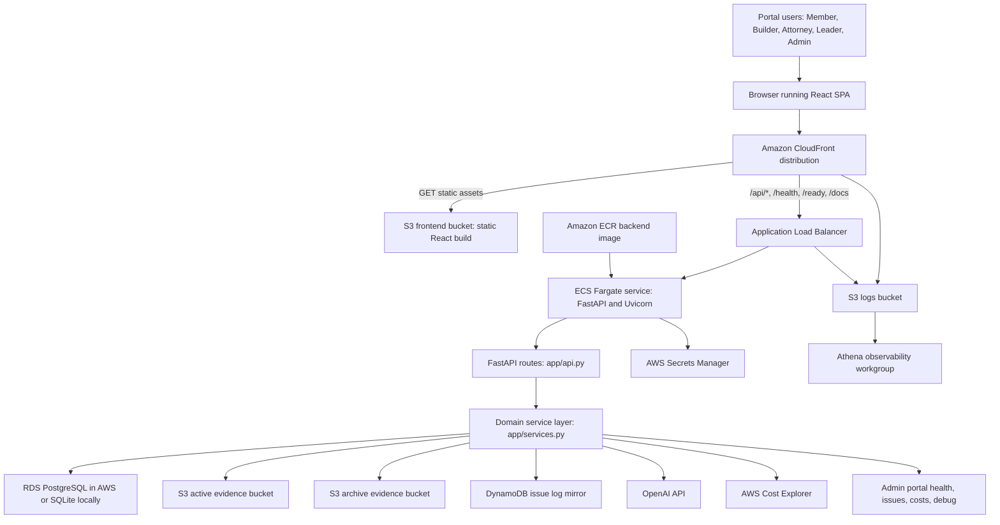

## Local Development Architecture

Local development uses the same code paths with lighter infrastructure. For daily UX work, the recommended setup is the local Vite frontend proxying to the shared AWS dev backend:

```bash
cd frontend-react
pnpm run dev:aws
```

Use `pnpm run dev:local` only when the FastAPI backend is also running locally.

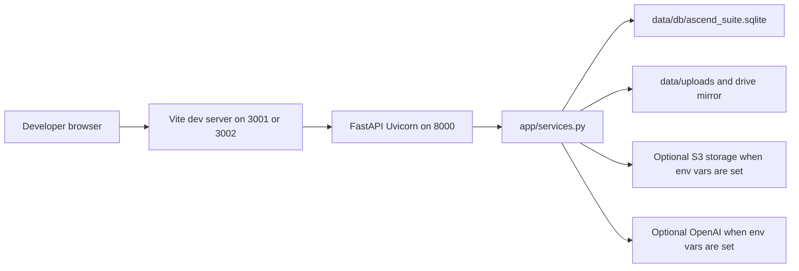

## Request Flow

1. A user opens the Ascend URL in the browser.
2. CloudFront serves the React application from the private S3 frontend bucket.
3. React reads URL parameters such as `portal`, `page`, `section`, `criterion`, and selected member IDs to render the correct portal view.
4. Login calls go to the appropriate backend route: `/api/auth/login`, `/api/builder/auth/login`, or `/api/staff/auth/login`.
5. FastAPI sends the request into `EvidenceService`, validates credentials, creates a session token, updates last-login metadata, and returns the user profile.
6. React stores the token client-side and sends it as a `Bearer` token on protected API calls.
7. FastAPI validates the token against member, builder, or staff session tables depending on the endpoint.
8. Service methods read and write database records, object storage files, AI call logs, operational events, support tickets, or issue logs.
9. The backend returns JSON envelopes to React, and React updates the portal without a full page reload.

## Portal-To-Service Flow

| Portal | Main frontend entry | Primary backend routes | Main data touched |
| --- | --- | --- | --- |
| Member Portal | `frontend-react/src/App.jsx` member views | `/api/member/*`, `/api/criteria/*`, `/api/evidence/*`, `/api/messages` | Profile, evidence, criteria, folders, project drafts, submitted exports, messages, upload history, member referrals. |
| Profile Builder Portal | Builder portal views | `/api/builder/*`, shared member/case routes | Assigned members, profile opportunities, task tracking, evidence summaries, member readiness. |
| Attorney Portal | Attorney portal views | `/api/attorney/*`, petition, recommendation, evidence review routes | Dossiers, critical role projects, original contributions, recommendation letters, petition drafts, review status. |
| Leader Portal | Leader portal views | `/api/leader/*`, assignment and timeline routes | Member portfolio, staffing, late-case alerts, feature requests, roadmap backlog, delivery timeline, referral program settings and payout tracking. |
| Admin Portal | Admin portal views | `/api/admin/*`, support and debug routes | Platform health, issue portal, cost explorer, login audit, support tickets, debug console, AWS sync state. |

## Authentication And Audit Flow

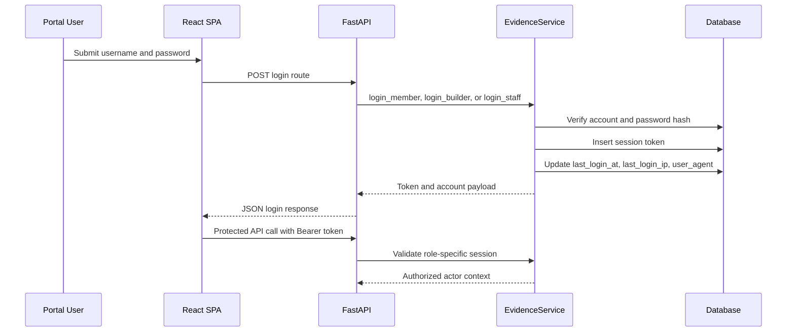

Important audit points:

- Login writes `last_login_at`, IP, forwarded-for header, and user agent where supported.
- Sensitive actions should include `actor_role`, `actor_email`, `actor_key`, or session-derived account IDs.
- Delete operations should be confirmed by the user in the UI before API submission.
- Soft delete and archive actions preserve the original evidence trail for attorney/admin review.

## Evidence Intake And Storage Flow

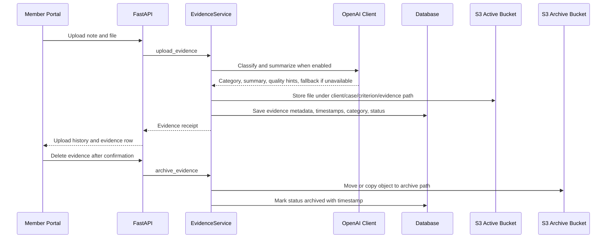

Current storage priority:

| Priority | Provider | Trigger |
| --- | --- | --- |
| 1 | S3 evidence bucket | `ASCEND_EVIDENCE_S3_BUCKET` or AWS storage env vars are configured. |
| 2 | Legacy Google Drive adapter | Legacy Drive config and access token are configured for a non-current provider path. |
| 3 | Local file system | Development fallback when no cloud storage provider is configured. |

Recommended S3 object pattern:

```text
clients/{client_id}/cases/{case_id}/evidence/{criterion_code}/{evidence_id}/original/{file_name}
archive/clients/{client_id}/cases/{case_id}/evidence/{criterion_code}/{evidence_id}/original/{file_name}
```

## Critical Role And Original Contributions Flow

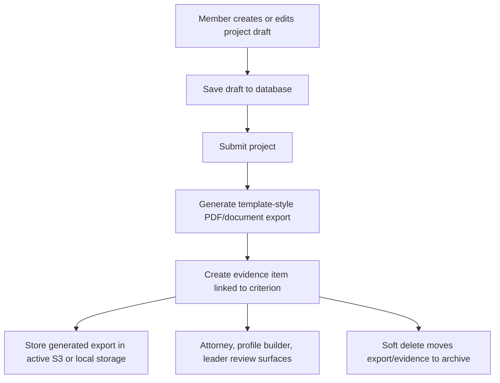

Key behavior:

- Draft saves remain in the database so members can leave and return later.
- Submitted records generate export evidence for the matching EB1A criterion.
- Critical Role records map to `leading_critical_role`.
- Original Contributions records map to `original_contributions`.
- Attorney, leader, and profile builder portals should read the same evidence metadata rather than duplicate member-entered data.
- Delete should be soft delete plus archive, never hard delete by default.

## Referral Program Flow

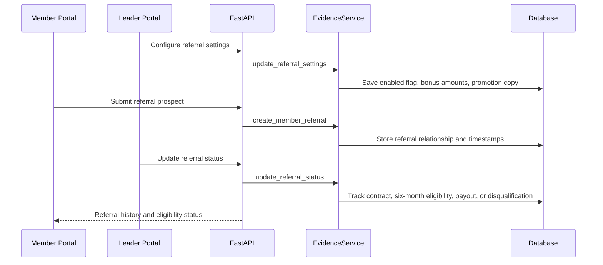

Key behavior:

- Referral records live in `member_referrals` and program configuration lives in `referral_settings`.
- Members see referral submission only when leadership has the program enabled.
- Bonus amounts are configurable by leadership so Ascend can run promotion seasons without code changes.
- Eligibility is tracked separately from payout: the referral is payable only after contract signing and at least six months with Ascend.
- Leader, admin, and future finance reporting should use the referral table as the source of truth for referral liabilities.

## AI Flow

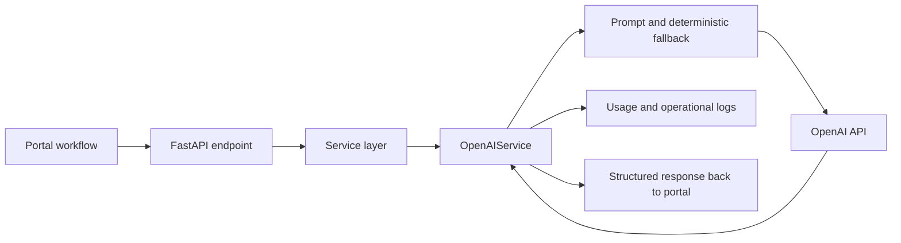

AI-backed functions:

| Function | User value | Fallback behavior |
| --- | --- | --- |
| Evidence classification | Suggests EB1A category and document type. | Deterministic local classifier and user-selected category. |
| Evidence summary | Produces attorney-friendly review notes. | Uses uploaded note and metadata. |
| Critical Role and Original Contribution guidance | Helps members structure strong project narratives. | Static prompts and examples remain visible in the form. |
| Petition drafting | Helps attorneys build stronger drafts faster. | Returns structured fallback draft with missing evidence warnings. |
| Recommendation and endeavor letters | Generates attorney-reviewed letter drafts. | Attorney can continue with manual prompt and evidence packet. |
| Support issue triage | Converts user report into admin-facing summary. | Rule-based severity and next-step summary. |

AI design rule:

- Portals should call backend application features, not AI providers directly.
- `app/openai_client.py` remains the provider boundary.
- Prompt versions, fallback status, usage counters, and errors should be observable from Admin Portal.

## Admin Operations Flow

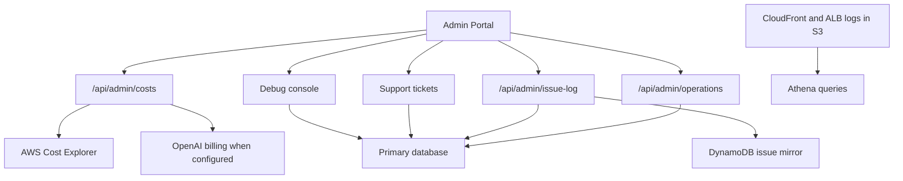

Admin Portal should answer:

- Are all portals online?
- Are API, database, S3, DynamoDB, OpenAI, and Cost Explorer healthy?
- Which issues are open, fixed, blocked, or synced to AWS?
- Who logged in and when?
- Which members, builders, attorneys, and leaders are delayed or blocked?
- What AWS and OpenAI costs are trending up?
- Which workflows are failing or falling back?

## Data Architecture

Primary relational entities:

| Entity group | Examples |
| --- | --- |
| Identity | Member accounts, builder accounts, staff accounts, sessions, login audit fields. |
| Case model | Clients, cases, criteria, readiness, assignments, timelines. |
| Evidence | Evidence items, folders, upload history, archived evidence, generated exports. |
| Member structured forms | Critical role projects, original contribution entries, draft and submitted state. |
| Growth and referrals | Referral settings, member referral relationships, eligibility milestones, payout status. |
| Collaboration | Messages, support tickets, task assignments, review notes. |
| Attorney work | Petition drafts, recommendation letters, endeavor letters, project associations. |
| Operations | Issue logs, admin cost snapshots, operational metrics, debug events. |

Database strategy:

- Local development can remain SQLite for speed and simplicity.
- AWS and production should use RDS PostgreSQL as the primary system of record.
- DynamoDB is best used for operational mirrors or high-volume append-style event streams, not as the main relational case database.
- S3 stores binary evidence and generated documents; the database stores metadata, ownership, status, and retrieval pointers.

## Security Architecture

Current security controls:

| Control | Implementation |
| --- | --- |
| HTTPS | CloudFront viewer protocol redirects to HTTPS. |
| Private frontend origin | S3 frontend bucket is accessed through CloudFront Origin Access Control. |
| API routing | CloudFront forwards API paths to ALB with authorization headers. |
| Runtime secrets | Secrets Manager injects database URL and OpenAI key into ECS tasks. |
| Storage isolation | S3 active and archive buckets are separate, encrypted, and private. |
| IAM scoping | ECS task role grants S3, Secrets Manager, DynamoDB issue table, and Cost Explorer permissions. |
| Database isolation | RDS is private and reachable from ECS security group. |
| Role checks | Backend routes validate member, builder, attorney, leader, or admin sessions before returning protected data. |

Recommended next security hardening:

- Add managed identity or Cognito/Okta/Auth0 with MFA for staff and admins.
- Add rate limiting and account lockout for login routes.
- Move sessions to expiring server-side records with rotation and revocation controls.
- Add CloudFront WAF for common abuse protection.
- Use KMS-managed encryption for evidence buckets when production compliance requirements increase.
- Add formal audit event table for every sensitive mutation.

## Observability And Reliability

Current observability:

- `/health` confirms the API process is alive.
- `/ready` reports dependency readiness.
- Admin System Health shows portals, FastAPI, database, S3, DynamoDB, OpenAI, and AWS services.
- CloudFront and ALB access logs are delivered to S3.
- Athena named queries support CloudFront and ALB error review.
- Admin Issue Portal stores records locally and mirrors to DynamoDB.
- Admin Cost Explorer pulls AWS Cost Explorer and OpenAI billing/usage when configured.

Recommended reliability additions:

- CloudWatch alarms for ECS unhealthy tasks, ALB 5xx, CloudFront 5xx, and RDS CPU/storage.
- Structured JSON application logs with request ID, actor ID, portal, endpoint, and case ID.
- OpenTelemetry traces from CloudFront request to FastAPI service to database and storage calls.
- Sentry or equivalent frontend/backend error capture.
- Background job queue for long AI and document-generation tasks.
- Backup and restore runbooks for RDS and S3 evidence buckets.

## Deployment Flow

Frontend deployment:

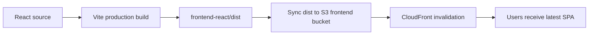

Backend deployment:

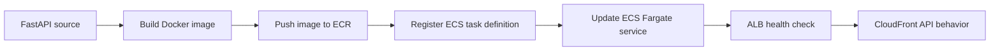

Infrastructure deployment:

- Terraform owns core AWS resources.
- Backend environment variables are defined in the ECS task definition.
- Sensitive values are injected from Secrets Manager.
- CloudFront path behaviors connect the static SPA and API into one product URL.
- Deployment code should remain versioned with every application change that needs infrastructure support.

## Runtime Endpoints

| Endpoint | Purpose |
| --- | --- |
| `/` | React SPA entry served by CloudFront/S3. |
| `/?portal=member&page=home` | Member home route. |
| `/?portal=builder&section=home` | Profile Builder route. |
| `/?portal=attorney&section=home` | Attorney route. |
| `/?portal=leader&section=home` | Leader route. |
| `/?portal=admin&section=health` | Admin System Health route. |
| `/api/auth/login` | Member login. |
| `/api/builder/auth/login` | Profile builder login. |
| `/api/staff/auth/login` | Attorney, leader, and admin login. |
| `/api/admin/operations` | Admin platform health and operations payload. |
| `/api/admin/issue-log` | Admin issue portal data and DynamoDB mirror. |
| `/api/admin/costs` | AWS/OpenAI cost explorer payload. |
| `/health` | Liveness check. |
| `/ready` | Dependency readiness check. |

## Main Code Ownership Map

| Area | Files |
| --- | --- |
| API contracts | `app/api.py` |
| Domain logic | `app/services.py` |
| Database schema and helpers | `app/db.py` |
| Storage abstraction | `app/storage.py` |
| S3 provider | `app/s3_storage.py` |
| Legacy optional Google Drive provider | `app/google_drive.py` |
| OpenAI provider and fallback logic | `app/openai_client.py` |
| Template exports | `app/template_exports.py` |
| React portal UI | `frontend-react/src/App.jsx` |
| Design system styles | `frontend-react/src/styles.css` |
| Local app config | `config/app.json`, `config/openai.json`, storage-related environment variables |
| AWS infrastructure | `deploy/aws/terraform/` in the AWS deployment repository |

## Scale Guidance

Expected near-term usage:

- 500 members.
- 200 employees across profile builder, attorney, leader, and admin roles.
- Evidence-heavy workflows with PDFs, images, letters, project exports, and generated documents.

Recommended primary database:

- Use RDS PostgreSQL for the main product database.
- Keep DynamoDB for issue-log mirroring, high-volume event streams, or future workflow/event tables if needed.
- Keep S3 as the durable source for binary files.

Why RDS PostgreSQL is the right system of record:

- The product is relational by nature: members, cases, assignments, evidence, criteria, projects, messages, attorneys, and review actions all need joins.
- Attorney and leader dashboards need filtered, sortable, auditable case data.
- PostgreSQL supports transactions, constraints, indexing, backups, SQL reporting, and future vector/search extensions.
- The projected user count is small enough that a modest RDS instance can handle the workload efficiently.

When to add more infrastructure:

| Trigger | Add |
| --- | --- |
| AI/document generation causes slow requests | Queue plus background workers. |
| Evidence search becomes slow | PostgreSQL full-text, pgvector, or OpenSearch. |
| Portal traffic spikes | ECS autoscaling and CloudFront cache tuning. |
| Staff workflows require real-time collaboration | WebSocket/SSE service or managed pub/sub. |
| Compliance requirements increase | WAF, MFA, KMS CMKs, immutable audit log, lifecycle retention policies. |

## Target-State Architecture

The recommended target is a modular monolith on managed AWS infrastructure first, not premature microservices.

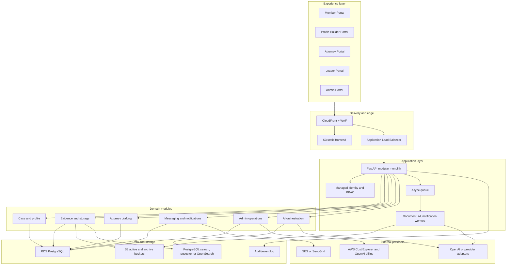

## Architecture Decisions

| Decision | Recommendation | Reason |
| --- | --- | --- |
| Primary database | RDS PostgreSQL | Best fit for relational EB1A case workflows, joins, constraints, dashboards, and auditability. |
| Binary evidence storage | S3 | Durable, low-cost, secure object storage with lifecycle and archive support. |
| Issue portal mirror | DynamoDB | Good fit for operational rows and fast admin sync, but not the primary case database. |
| Backend shape | FastAPI modular monolith | Faster development, simpler deployment, clean domain boundaries without distributed-service overhead. |
| Frontend delivery | CloudFront + S3 | Low-cost global delivery and simple SPA hosting. |
| AI integration | Backend-only provider boundary | Prevents key exposure, centralizes prompts, tracks usage, and preserves fallback behavior. |
| Deployment | Terraform plus container/image release flow | Keeps infrastructure and application changes reproducible. |

## Immediate Architecture Backlog

| Priority | Item | Value |
| --- | --- | --- |
| P0 | Complete PostgreSQL migration hardening with formal migrations | Reduces production data risk and removes SQLite-only assumptions. |
| P0 | Centralize auth/session expiry and role capability mapping | Prevents cross-portal authorization drift. |
| P0 | Add immutable audit event table for sensitive user journeys | Improves legal, operational, and security traceability. |
| P1 | Add queue-backed AI/document generation | Prevents long requests from blocking portal UX. |
| P1 | Add CloudWatch alarms and structured request logs | Speeds up production debugging. |
| P1 | Add S3 lifecycle, retention, and archive policies per evidence class | Lowers storage cost and improves compliance posture. |
| P1 | Add CI/CD build, test, deploy, and rollback workflow | Reduces deployment risk. |
| P2 | Add search index for evidence retrieval and attorney drafting | Improves petition drafting speed and citation quality. |
| P2 | Add WAF and managed identity/MFA | Improves security posture before broad customer rollout. |

## Summary

Ascend's architecture should stay simple at the product layer and strong at the infrastructure layer.

The right near-term architecture is:

- React + Vite SPA for all portals.
- CloudFront + S3 for frontend delivery.
- CloudFront path routing to ALB for API traffic.
- FastAPI on ECS Fargate for backend execution.
- RDS PostgreSQL as the primary database.
- S3 active and archive buckets for evidence and generated exports.
- OpenAI behind backend-only service boundaries.
- DynamoDB for issue-log mirroring and operational extensions.
- Secrets Manager, IAM, ALB/CloudFront logs, Athena, and Admin Portal for operations.

This stack comfortably supports the current 500-member and 200-employee use case, with a clear path to 10x growth by adding connection pooling, queue-backed workers, stronger search, autoscaling, structured observability, and formal release gates.
